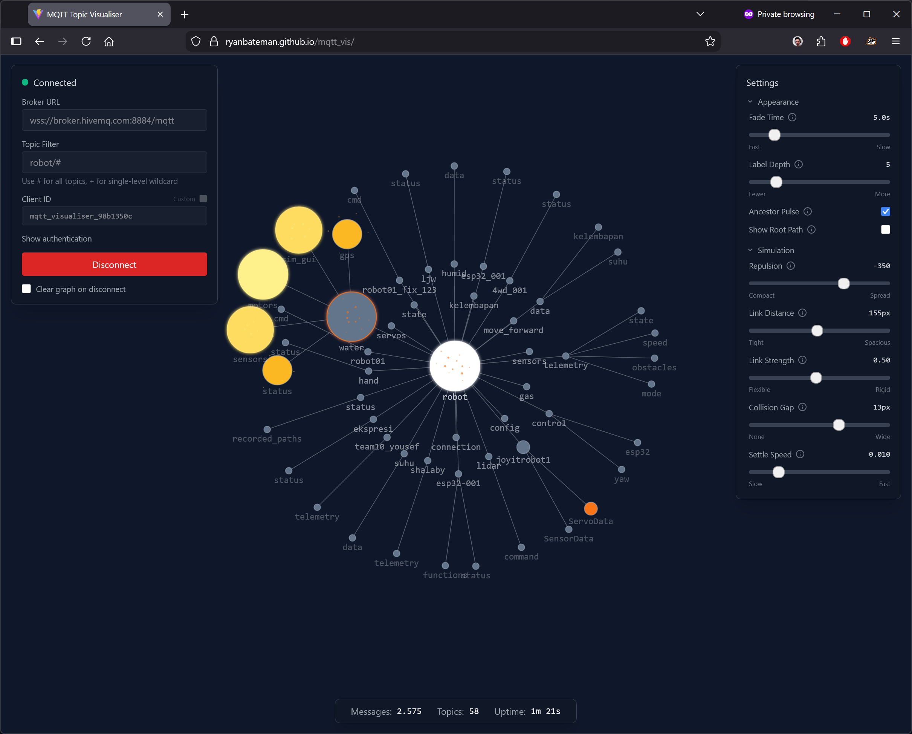

# MQTT Topic Visualiser

A browser-based, real-time visualisation of MQTT topic trees. Connect to any MQTT broker over WebSocket, subscribe with wildcard support, and watch topics come alive as an animated force-directed graph. Nodes glow, pulse, emit particles, and shift colour based on publish activity.

**No backend required** — the entire application is a static SPA. The MQTT connection runs directly from the user's browser to the broker via WebSocket. You host static files and that's it.



## Features

- **Force-directed graph** — topics rendered as an interactive D3.js SVG graph with zoom, pan, and drag
- **Live message tracking** — nodes grow and shrink based on message frequency using exponential moving average (EMA) rate calculation
- **Visual effects** — three layered effects on message publish: glow/pulse (SVG filter), particle burst, and heat-map colouring
- **Custom colour scale** — nodes shift from slate through sky blue, orange, amber, to yellow as activity increases
- **Ancestor pulse** — optional: when a message arrives, all parent nodes up to the root pulse (toggleable)
- **Root path filtering** — hide structural ancestor nodes above the subscription prefix (e.g. subscribing to `sensors/temp/#` with this off shows only `temp` and its children)
- **Zoom-aware labels** — labels stay constant screen size; two visibility modes: Zoom (fade smoothly based on zoom level) or Depth (hard cutoff at a fixed tree depth)
- **Configuration file** — ship a `config.json` alongside the app to customise all defaults for your deployment (broker URL, topic filter, simulation params, UI state, and more)
- **Auto-connect** — optional auto-connect on page load, configurable via UI checkbox or `config.json`
- **Collapsible panels** — both connection and settings panels collapse to save screen space; status indicator stays visible when the connection panel is collapsed
- **Settings panel** — sliders for visual and simulation parameters with collapsible sections and hover tooltips
- **MQTT client ID** — randomised by default (`mqtt_visualiser_<hex>`), with a toggle to manually define a custom ID. Can be locked to a fixed value via `config.json`.
- **Connection persistence** — broker URL, topic filter, username, client ID, and autoconnect preference are saved to localStorage
- **Clear on disconnect** — optional checkbox to reset the graph when disconnecting
- **Shareable links** — copy a URL with broker and topic filter pre-filled as query params; recipients see the connection fields pre-populated
- **PNG export** — export the full graph as a PNG image (auto-computed bounding box, 2x resolution, dark background)
- **Labels toggle** — turn labels on or off entirely; label settings (mode, depth) are grouped in a collapsible sub-section
- **Smooth node sizing** — node radius changes are interpolated smoothly via exponential lerp in a 60fps animation loop, avoiding jumpy resizing on message bursts or decay ticks
- **Dark theme** — designed for dark backgrounds with glow and particle effects
- **Wildcard subscriptions** — supports MQTT `#` (multi-level) and `+` (single-level) wildcards

## Quick Start

```bash
npm install
npm run dev
```

Open the URL shown by Vite (typically `http://localhost:5173`), enter a WebSocket broker URL (e.g. `ws://localhost:9001`) and a topic filter, then click Connect.

### Build for production

```bash
npm run build
npm run preview    # preview the production build locally
```

The output in `dist/` is a fully static SPA — deploy it to any static hosting (GitHub Pages, Netlify, S3, etc.). Edit `dist/config.json` after building to customise defaults for your deployment without rebuilding.

## Usage

### Connection Panel (top-left)

The connection panel is collapsible — click the header to toggle. The status indicator (connection dot + label) remains visible when collapsed.

| Field | Description |
|---|---|
| **Broker URL** | WebSocket endpoint (`ws://` or `wss://`) |
| **Topic Filter** | MQTT subscription filter. `#` for all topics, `+` for single-level wildcard |
| **Client ID** | Randomised by default. Toggle "Custom" to define your own (disabled while connected). Can be locked via config. |
| **Authentication** | Optional username/password (click "Show authentication") |
| **Auto-connect on load** | When checked, the app connects automatically on page load using the current settings |
| **Clear graph on disconnect** | Reset the graph when disconnecting |
| **Copy connection share link** | Copies a URL with the current broker and topic filter as query params to the clipboard |
| **Export graph as PNG** | Downloads the full graph as a PNG image (`mqtt-vis-{timestamp}.png`) |

### Settings Panel (top-right)

The settings panel is collapsible — click the header to toggle.

**Appearance**
- **Fade Time** — how long messages affect node size and colour (EMA time constant)
- **Labels** — toggle labels on or off entirely. When on, the following sub-settings appear:
- **Label Mode** — toggle between two label visibility strategies:
  - **Zoom** — labels fade in/out based on zoom level and tree depth (deeper labels disappear first when zoomed out)
  - **Depth** — labels are shown or hidden by a fixed tree depth cutoff, independent of zoom level
- **Label Depth / Max Label Depth** — the slider meaning changes with the label mode. In Zoom mode, it controls how many depth levels remain visible when zoomed out. In Depth mode, it sets the hard cutoff depth.
- **Ancestor Pulse** — toggle whether parent nodes pulse when descendants receive messages
- **Show Root Path** — toggle visibility of structural ancestor nodes above the subscription prefix

**Simulation**
- **Repulsion** — how strongly nodes push each other apart
- **Link Distance** — ideal spacing between connected parent-child nodes
- **Link Strength** — how rigidly links enforce their ideal distance
- **Collision Gap** — extra space around nodes to prevent overlap
- **Settle Speed** — how quickly the graph stops moving after changes

### Status Bar (bottom)

Shows total messages received, unique topics discovered, and session uptime.

## Configuration

The app loads `config.json` from the server root on startup. Edit `public/config.json` before building, or `dist/config.json` after building, to customise defaults for your deployment.

All fields are optional — omitted fields use hardcoded defaults. Values saved in the user's browser (localStorage) take precedence over config values.

### Security Warning

**The `password` field in `config.json` is stored in plaintext and served as a static file.** Anyone who can access the hosted site can read it by fetching `config.json` directly. Do not include sensitive credentials unless the deployment is on a private network or behind authentication.

### Available Options

| Field | Type | Default | Description |
|---|---|---|---|
| `brokerUrl` | string | `"wss://broker.hivemq.com:8884/mqtt"` | Default broker WebSocket URL |
| `topicFilter` | string | `"robot/#"` | Default MQTT subscription filter |
| `clientId` | string \| null | `null` | Fixed MQTT client ID. When set to a string, the ID is locked and cannot be changed by the user. When `null`, a random ID is generated. |
| `username` | string | `""` | Default username |
| `password` | string | `""` | Default password (**see security warning above**) |
| `autoconnect` | boolean | `false` | Connect automatically on page load |
| `emaTau` | number | `5` | EMA time constant in seconds |
| `showLabels` | boolean | `true` | Show or hide node labels |
| `labelDepthFactor` | number | `5` | Label depth visibility factor |
| `labelMode` | `"zoom"` \| `"depth"` | `"zoom"` | Label visibility mode: zoom-based fade or fixed depth cutoff |
| `ancestorPulse` | boolean | `true` | Pulse parent nodes on descendant messages |
| `showRootPath` | boolean | `false` | Show structural ancestor nodes above subscription prefix |
| `repulsionStrength` | number | `-350` | Node repulsion force |
| `linkDistance` | number | `155` | Ideal parent-child link distance (px) |
| `linkStrength` | number | `0.5` | Link rigidity (0-1) |
| `collisionPadding` | number | `13` | Extra collision gap around nodes (px) |
| `alphaDecay` | number | `0.01` | Simulation settle speed |
| `settingsCollapsed` | boolean | `false` | Start with settings panel collapsed |
| `connectionCollapsed` | boolean | `false` | Start with connection panel collapsed |

### Precedence

For any given setting, the resolution order is:

1. **URL query params** (`?broker=...&topic=...`) — highest priority, one-time override for `brokerUrl` and `topicFilter` only (not persisted)
2. **localStorage** (user's previous session)
3. **config.json** (deployment defaults)
4. **Hardcoded defaults** — lowest priority

**Exception:** when `clientId` is set to a non-null string in `config.json`, it is always used regardless of localStorage. This is intended for deployments that require a specific client identity.

### Example

```json
{
  "brokerUrl": "wss://my-broker.example.com:8884/mqtt",
  "topicFilter": "sensors/#",
  "autoconnect": true,
  "settingsCollapsed": true,
  "connectionCollapsed": true,
  "repulsionStrength": -400,
  "linkDistance": 120
}
```

This would configure the app to auto-connect to a custom broker on load with both panels collapsed and a wider graph layout. The user can still change settings in the UI — their changes persist in localStorage and take priority on subsequent visits.

## Tech Stack

| Layer | Choice |
|---|---|
| Framework | React 18 + TypeScript (strict) |
| Build | Vite 5 |
| Styling | Tailwind CSS v3 |
| Visualisation | D3.js v7 (force simulation, SVG) |
| MQTT | mqtt.js v5 (browser WebSocket bundle) |
| State | Zustand v5 |
| Deploy | Static SPA |

## Project Structure

```
public/
  config.json              # Deployment configuration (copied to dist/ on build)
src/
  types/
    index.ts               # TopicNode, GraphNode, GraphLink, ConnectionParams, Particle
  stores/
    topicStore.ts           # Zustand store: topic tree, EMA rates, decay, settings
  hooks/
    useMqttClient.ts        # MQTT lifecycle hook, localStorage persistence
  services/
    mqttService.ts          # mqtt.js WebSocket wrapper
  components/
    ConnectionPanel.tsx     # Broker URL, topic filter, client ID, auth, connect/disconnect
    TopicGraph.tsx          # SVG container, syncs store state to GraphRenderer
    GraphRenderer.ts        # D3 force simulation, nodes/links/labels/effects/particles
    SettingsPanel.tsx       # Sliders, toggles, collapsible sections, portal tooltips
    StatusBar.tsx           # Message/topic counts, uptime
  utils/
    config.ts              # Config loader: fetch config.json, AppConfig interface
    topicParser.ts          # Topic string parsing, tree operations, ancestor paths
    sizeCalculator.ts       # Logarithmic node radius from aggregate rate
    colorScale.ts           # Custom multi-stop colour scale (slate > sky > orange > amber > yellow)
```

## How It Works

### Topic Tree

MQTT topics are `/`-delimited (e.g. `home/kitchen/temp`). Each segment becomes a node in a tree. Parent nodes are created implicitly — even if no message was ever published directly to `home/`, the node exists as an ancestor.

### Rate Tracking

Message frequency uses an Exponential Moving Average with a configurable time constant (default 5s). A decay timer runs every 500ms, smoothing rates and decaying idle topics toward zero.

### Aggregate Rates

Each node's aggregate rate = its own message rate + the sum of all children's aggregate rates, propagated bottom-up after each decay tick. Parent nodes reflect the total activity of their entire subtree.

### Node Sizing

Radius follows a logarithmic scale to prevent high-frequency topics from dominating:

```
radius = MIN_R + (MAX_R - MIN_R) * (log(1 + aggregateRate) / log(1 + MAX_RATE))
```

Size changes are smoothly interpolated via an exponential lerp in the 60fps animation loop, preventing jumpy resizing on message bursts or decay ticks.

### D3 + React Integration

React owns the `<svg>` container element. D3 manages the force simulation and directly manipulates SVG elements inside it via a ref. Individual graph elements (circles, lines, text) are not React-rendered — D3 handles them for performance.

## Hosting Notes

This is a purely client-side application. The hosted files are static HTML, CSS, and JS. All MQTT connections happen directly between the user's browser and whatever broker they configure.

**Mixed content**: GitHub Pages (and most static hosts) serve over HTTPS. Browsers block mixed content, so users will only be able to connect to `wss://` brokers, not plain `ws://`. This is a browser security restriction, not an application limitation.

**Self-hosted with HTTPS**: If you serve this app over HTTPS but your MQTT broker only supports plain WebSocket (`ws://`), you need a reverse proxy to bridge the protocols. Add a WebSocket proxy location to your nginx config:

```nginx
location /mqtt_ws/ {
    proxy_pass http://your-broker-host:9001/;
    proxy_http_version 1.1;
    proxy_set_header Upgrade $http_upgrade;
    proxy_set_header Connection "upgrade";
    proxy_set_header Host $host;
    proxy_read_timeout 86400;
}
```

Then set `brokerUrl` in `config.json` to `wss://your-https-host/mqtt_ws/`. The browser connects via `wss://` to nginx, which upgrades the connection and proxies to the broker over plain `ws://`.

**Customising a deployment**: Edit `config.json` in the deployed `dist/` directory (or `public/config.json` before building) to set broker defaults, enable autoconnect, collapse panels, or lock the client ID for your specific use case.

## Acknowledgement

This project was built with [OpenCode](https://opencode.ai) and Claude Opus 4 (`claude-opus-4-6`) by Anthropic.

## License

MIT
